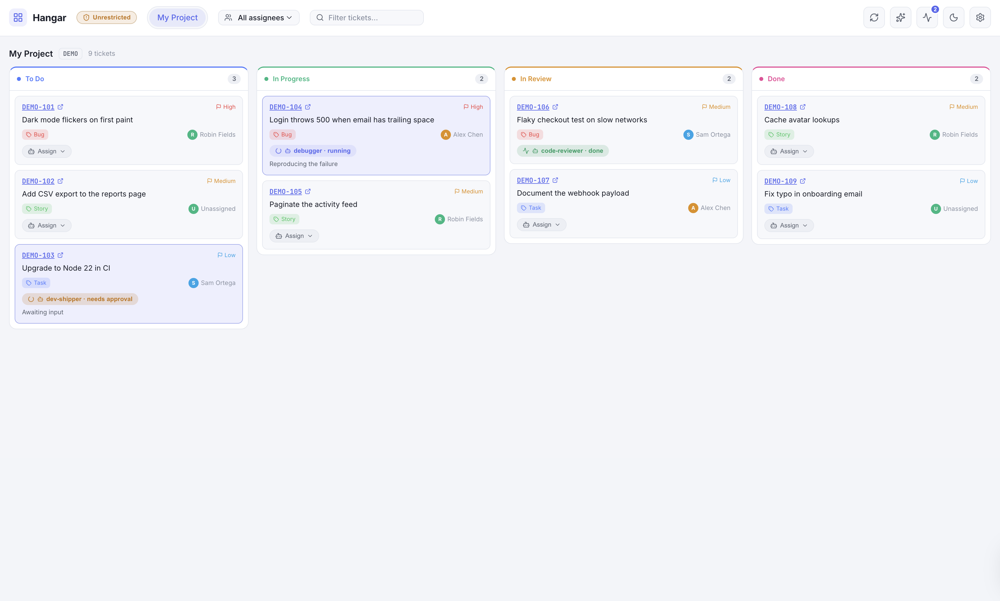
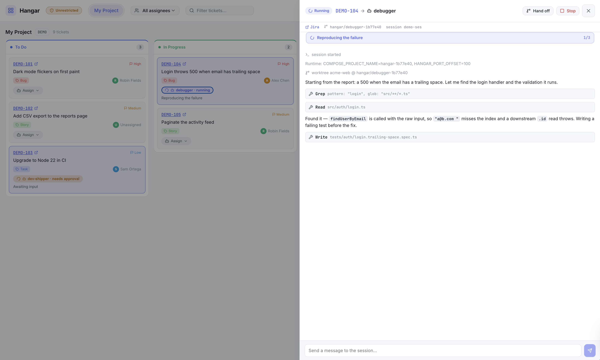
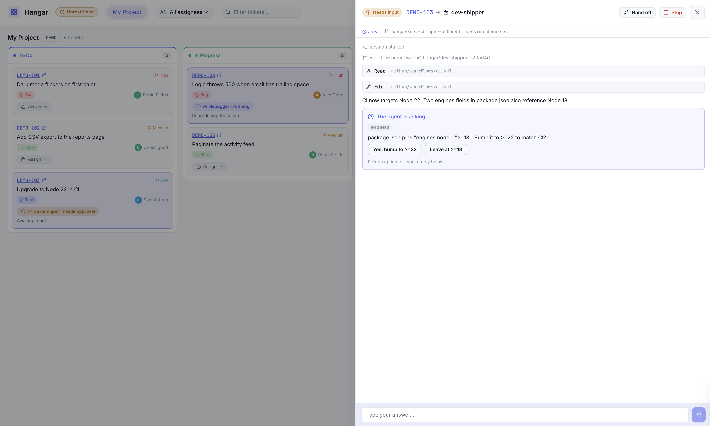
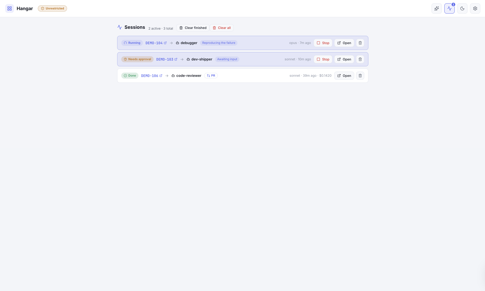
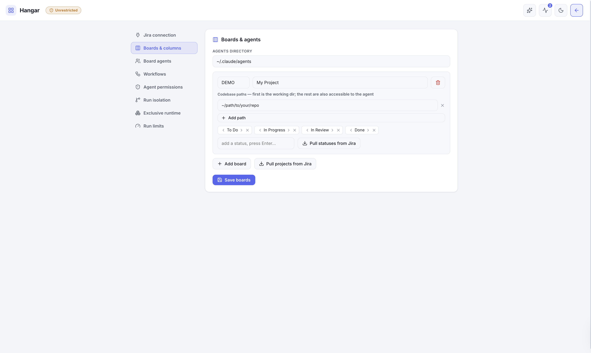

<div align="center">


# Hangar

**A mouse-driven board that turns Jira tickets into Claude Code agent sessions.**

Pull your Jira tickets onto a Kanban board, assign an agent or skill to a card, and watch a
real [Claude Code](https://claude.com/claude-code) session run — streaming live, isolated per
run, with a human in the loop when it matters.



</div>

---

## Highlights

- **Your Jira, as a board** — tickets stream in live as Kanban columns, across multiple
  projects. Filter by assignee or text, and drag a card between columns to transition the issue.
- **Launch an agent on a ticket** — pick from your `~/.claude/agents` and `~/.claude/skills`,
  optionally add a note, and run. The session runs in that board's repo (with extra repos passed
  as `additionalDirectories` for cross-repo work).
- **Live run panel** — token-by-token output, tool calls, the captured session id and running
  cost, and an auto-detected PR link.
- **Human-in-the-loop** — run unrestricted, or _gated_: reads and edits auto-run while risky
  shell commands pause for approval. Agent questions surface right in the panel with answer buttons.
- **Run isolation** — each run gets its own git worktree + branch, so multiple agents work the
  same repo in parallel without clobbering each other. Per-run env namespaces Docker/compose
  stacks; an _exclusive runtime_ list serializes agents that need shared ports/tunnels.
- **Workflows & handoffs** — chain agents/skills into per-board pipelines, or hand one run's
  result straight to another agent.
- **No credentials? No problem** — a built-in [demo mode](#demo-mode) runs the whole thing on a
  fictional board with seeded sessions.

## Demo mode

Try Hangar with **no Jira and no config** — a fictional board with seeded sessions:

```sh
HANGAR_DEMO=1 npm run dev
```

Open **http://localhost:5173**. Your real config and credentials are never read or written in
this mode. (This is exactly how the screenshots in this README were produced.)

## Quick start

**Requirements:** Node 18+, and a working [Claude Code](https://claude.com/claude-code) login
(or an `ANTHROPIC_API_KEY`) — sessions use your existing auth.

```sh
git clone https://github.com/thalissonbarbosas/hangar.git
cd hangar
npm install            # root tooling (concurrently)
npm run install:all    # server + web dependencies
```

Then either explore in **[demo mode](#demo-mode)**, or connect your own Jira:

```sh
cp .env.example .env                               # add your Jira base URL, email, API token
cp hangar.config.example.json hangar.config.json   # or just configure boards in the UI
npm run dev                                         # server :3001 + web :5173
```

Open **http://localhost:5173** and click **⚙ Settings** to finish setup:

- **Jira connection** — base URL, email, and an [API token](https://id.atlassian.com/manage-profile/security/api-tokens),
  with a **Test** button. Saved to `.env` (the token is write-only — never sent back to the browser).
- **Boards & agents** — add boards, edit project key / name / repo paths, and edit the column
  statuses. **Pull projects / statuses from Jira** discovers real values. Saved to
  `hangar.config.json` and hot-reloaded — no restart.

A ticket whose status isn't in a board's column list lands in an `(unmapped)` column, so nothing
silently disappears. The board still loads (columns + agents) before Jira is configured.

## A look around

**Live agent session** — streaming output, tool calls, the worktree branch, session id, and cost:



**Human-in-the-loop** — the agent asks; you answer inline (gated mode pauses risky tools the same way):



**Sessions view** — every run, active first, with state, model, age, cost, and a PR link when one was opened:



**Configure everything in the UI** — boards, columns, repo paths, and agents, no file editing required:



## How it works

A small monorepo:

```
hangar/
  server/   # Node + TypeScript + Express: Jira adapter, agent/skill registry, the SDK runner
  web/      # React + Vite + TypeScript: the board UI
```

The server talks to Jira via the REST API (one JQL per board) and spawns Claude Code sessions
with [`@anthropic-ai/claude-agent-sdk`](https://www.npmjs.com/package/@anthropic-ai/claude-agent-sdk).
When you assign an agent to a ticket, its `.md` body becomes the system prompt and its
`model:`/`tools:` configure the run; the run executes in the board's repo path. The web app
streams each session over SSE into the run panel.

Run records persist as JSON under `.hangar/` so transcripts and results survive a restart.

### Configuration

`hangar.config.json` (see [`hangar.config.example.json`](hangar.config.example.json)):

| Field                       | Meaning                                                                                               |
| --------------------------- | ----------------------------------------------------------------------------------------------------- |
| `agentsDir`                 | where to read agents (default `~/.claude/agents`)                                                     |
| `boards[]`                  | `key` (Jira project), `name`, `statuses` (column order), `repoPaths`, optional `agents` / `workflows` |
| `bypassPermissions`         | `true` = unrestricted; `false` = gated (approve risky shell)                                          |
| `isolateRuns`               | run each session in its own git worktree + branch (default on)                                        |
| `exclusiveAgents`           | agent/skill names that need shared ports/tunnels — run one at a time                                  |
| `maxTurns` / `maxBudgetUsd` | per-run limits (default 300 turns, no spend cap)                                                      |

Environment (`.env`, see [`.env.example`](.env.example)): `JIRA_BASE_URL`, `JIRA_EMAIL`,
`JIRA_API_TOKEN`, optional `JIRA_MY_TICKETS_ONLY`, `PORT`, and `HANGAR_DEMO`.

## Scripts

```sh
npm run dev         # server + web together
npm run dev:server  # server only (:3001)
npm run dev:web     # web only (:5173)
npm run typecheck   # tsc --noEmit across server + web
```

## Permissions & safety

By default agents run **unrestricted** — like `claude --dangerously-skip-permissions` — so they
can edit files and run any shell command, including `git push`. A topbar flag makes this visible,
and **gated** mode (Settings → Agent permissions) holds mutating/unknown shell commands for an
explicit Allow/Deny. Run Hangar against repos you trust, and prefer gated mode if you're unsure.

## License

[MIT](LICENSE) © Thalisson Barbosa
