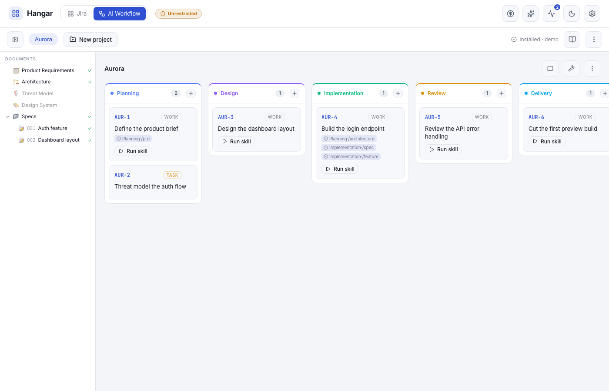
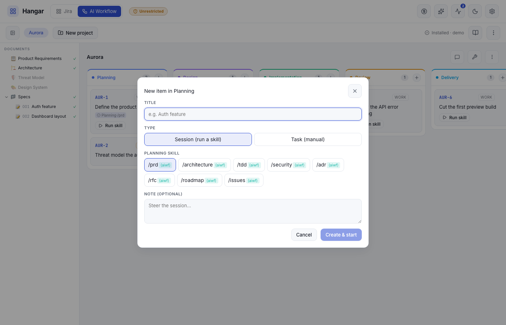

# AI Workflow connection

Hangar has two **connections** (work sources), selected from the topbar switcher:

- **Jira** — the default: project boards + filters, backed by the Jira REST API.
- **AI Workflow** — a **self-hosted** source for projects that use
  [ai-workflow](https://github.com/0xrafasec/ai-workflow) (aiwf, by
  [0xrafasec](https://github.com/0xrafasec)) instead of a tracker.

Each connection renders its own sub-menu row beneath the switcher and shares the board surface and
the live run panel. **All AI Workflow runs are executed by Claude** (Hangar's existing
`@anthropic-ai/claude-agent-sdk` engine) — the connection is a methodology + a board, not a different
model. A project that happens to be Gemini-based (`GEMINI.md`) just becomes context Claude reads.



> Keep this doc in sync with the feature — see the rule in `CLAUDE.md`.

## What aiwf is

ai-workflow is a Claude-native, spec-driven-development toolkit installed globally into `~/.claude/`
(`skills/`, `agents/`, `commands/`, `CLAUDE.md`, `settings.json`) plus an `aiwf` launcher in
`~/.local/bin/`. Because Hangar already reads `~/.claude/skills`, **once aiwf
is installed its skills appear in Hangar automatically** — no extra wiring.

The skills, by lifecycle phase:

| Phase            | Skills                                                       |
| ---------------- | ------------------------------------------------------------ |
| Planning         | `prd`, `architecture`, `tdd`, `security`, `adr`, `rfc`, `roadmap`, `issues` |
| Design           | `design`, `verify-design`                                    |
| Implementation   | `spec`, `feature`, `fix`, `autopilot`, `factory`, `new-project` |
| Review           | `review`, `sec-review`                                       |
| Delivery         | `commit`, `pr`                                               |

## Install / detect / uninstall

The AI Workflow sub-bar shows install state and an options menu:

- **Detect** — `GET /api/aiwf/status` reports `installed` based on the `~/.local/bin/aiwf` launcher
  and/or the core aiwf skills present in `~/.claude/skills`.
- **Install** — a one-click button (with a confirm) runs the aiwf bootstrap
  (`curl -fsSL …/bootstrap.sh | bash`) via `POST /api/aiwf/install`. Hangar only mutates `~/.claude`
  on your click.
- **Skills guide (📖)** — a **BookOpen** button opens a modal that lists every aiwf skill
  organised by phase tab (Planning → Design → Implementation → Review → Delivery). Each skill
  shows its name and description; skills not yet installed appear dimmed with a **not installed**
  badge. Descriptions are read from the installed skill's own frontmatter, with static fallbacks
  for uninstalled ones.
- **Options menu (⋯)** — open the repo, open the author, **Reinstall**, and **Uninstall**.
  Uninstall (`POST /api/aiwf/uninstall`) runs `aiwf uninstall-all` — it removes the **toolkit only**;
  your projects and their board cards are never touched.

## Projects

An AI Workflow **project** is a registered local repo. Create one from the sub-bar ("＋ New project"):

- **New** — scaffolds the repo by running the `new-project` skill in place, then registers it.
- **Adopt** — registers an existing repo as-is.

Each project chip has an **Edit** (pencil) button that opens a modal to change the project's display
name and **location** (`repoPath`) in place — useful when the repo moves on disk or was registered
with the wrong path. The project keeps its id, and since the board lives in Hangar's data dir keyed
by that id, the cards carry over unchanged — re-pointing the location just runs future work against
the new path.

Projects are stored in `hangar.config.json` under `aiWorkflow.projects` (see
[Configuration](#configuration)). Cards are **runtime board state** — their `status:` and history
are rewritten on every move and run — so they live in **Hangar's own data dir** at
`<HANGAR_DATA_DIR>/aiwf/<projectId>/board/*.md` (gitignored, like `.hangar/`), **not** in the
project repo, which stays pristine. A task's durable description/acceptance criteria belong in a
tracked `docs/specs/NNN_*.md` (via the `spec` skill); the lasting record lives in `docs/` + the PR.
Point dev and stable Hangar instances at one `HANGAR_DATA_DIR` to share a project's board.

**Remove** — hovering a project chip in the sub-bar reveals a remove (✕) button. It unregisters the
project from Hangar (after a confirm) via `DELETE /api/aiwf/projects/:id`; your repo stays untouched
and the project's board state under `<HANGAR_DATA_DIR>/aiwf/<projectId>/board/` is left on disk. If
the removed project was the selected one, the view falls back to the first remaining project.

## The phase board

The board **columns are the aiwf lifecycle phases** plus a terminal **Complete** column
(configurable per project):

```
Planning → Design → Implementation → Review → Delivery → Complete
```

A **card is a work thread** that flows through the phases:

- **Create** — each phase column has a **＋** to add a **Session** (pick one of that phase's skills,
  with an optional note → creates the card and starts the run) or a **Task** (a manual card, no skill).
- **Move** — dragging a card into another phase column **pops up that phase's skill picker** to start a
  session there (or "Just move, no session"). Dropping into **Complete** just marks it done — no popup.
- **History** — every finished session is appended to the card's history, tagged with the phase it ran
  in. The card shows a compact `phase·/skill ✓` trail; the repo also accumulates the skill's own
  artifacts (`docs/ARCHITECTURE.md`, specs, etc.). Board + repo together are the project history.
- **Per-card options (⋯)** — each card has a `⋯` menu with:
  - **See data** — opens a read-only modal showing the card's key, title, status, kind, skill, PR link,
    description, and the full history list with timestamps and summaries.
  - **Archive** — soft-hides the card from its phase column (reversible). Archived cards are grouped in
    a collapsible **Archived (N)** section below the columns where they can be **Unarchived**, inspected,
    or deleted.
  - **Delete** — permanently removes the card file (with a confirm). Run records under
    `<DATA_DIR>/runs/` are unaffected.

Each phase column's skill list matches the table above; the `Complete` column has none. The `roadmap`
skill is additionally instructed to **seed the board** — it writes one card per roadmap task into
the project's board dir (Hangar passes it the absolute data-dir path).



### Spec tasks

Skills like `/spec` and `/roadmap` write spec files into the project repo under
`docs/specs/NNN_<slug>.md` (or `docs/specs/NNN_<slug>/README.md` for sliced specs). Hangar scans
that directory and surfaces matching files as **read-only spec cards** in a collapsible
**Specs (N)** section below the phase columns.

- **Key scheme** — `SPEC-NNN`, where `NNN` is the numeric prefix of the filename or directory
  (e.g. `006_aiwf-spec-tasks.md` → `SPEC-006`).
- **Title** — the first `# ` heading in the file, with common skill-generated prefixes stripped
  (`Spec NNN — `, `Feature: `, `Phase NNN: `).
- **Run skill** — running a skill on a spec (the row "▶ Run skill" button, the spec sidebar, or
  dragging the spec onto a phase column) **creates a board task** for it: a `thread` card copying
  the spec's title and description (including the `Spec: <path>` line) in the chosen phase
  (Implementation for the row/sidebar; the dropped column for a drag). The session then starts from
  that card, so the work has a visible home and accruing history. Running a skill on the same spec
  again **reuses** the existing (non-archived) board task rather than creating a duplicate, so all
  history accumulates on one card. The read-only `SPEC-NNN` card stays visible.
- **Task isolation** — when a code, delivery, or review skill (`feature`, `fix`, `commit`, `pr`,
  `review`, `sec-review`) is run on a spec-derived task, Hangar creates a shared worktree on a
  semantic branch derived from the spec's filename and type (e.g. `feat/standardize-agent-skill-selects`,
  always based on `main`). The promoted board card preserves this semantic branch — the server
  recovers the source spec from the card's `Spec: <path>` description line — so it does not regress
  to `feat/<card-key>`. Every skill run on that card reuses the same branch, so `/commit` and
  `/pr` deliver from the task's actual worktree even when started as a new run rather than a
  handoff. The state persists until the card is transitioned to Complete.
- **Read-only guarantee** — spec files are never modified by Hangar. Transition and archive/delete
  routes return `400 Spec cards are read-only.` for `SPEC-*` keys — the one exception is
  transitioning to `Complete`, which succeeds and resets the card's task-worktree state.
- The section is hidden when `docs/specs/` is absent or contains no matching files.

### Execution model

Most AI Workflow sessions run **in place** in the project repo, because aiwf manages its own git
(`/commit` and `/pr`) and its planning/doc skills must write into the real repo.

**Spec card runs** with code, delivery, or review skills are the exception — see **Task isolation**
above. Every other skill run on a regular board card also stays in place, except `feature` and `fix`
on regular cards, which run in a per-run worktree + branch so parallel implementation runs can't
clobber each other. The `autopilot`/`factory` orchestrators always stay in place: they spawn their
own worktree subagents and open their own PRs.

Each run is a normal skill session streamed into the run panel; on success its result is logged to
the card's history. A PR URL detected in the output is saved to the card and persists across restarts.

### Card file format

`<HANGAR_DATA_DIR>/aiwf/<projectId>/board/<KEY>.md` — flat YAML frontmatter + markdown body + an
embedded history block:

```markdown
---
key: DC-1
title: Implement the login endpoint
status: Implementation
kind: thread
skill: feature
pr: https://github.com/me/app/pull/3
---

Acceptance criteria / context — fed into the agent prompt.

<!--HANGAR_HISTORY
[{ "phase": "Planning", "skill": "architecture", "at": 1718000000000, "runId": "…", "summary": "…" }]
HANGAR_HISTORY-->
```

`status` is the card's current phase column; `kind` is `thread` (runs skills) or `task` (manual).
`archived: true` marks a card as soft-hidden from the active columns (omitted on active cards).
Cards integrate directly with Hangar's run engine, so the run panel, sessions view, and all run
features work unchanged for aiwf cards.

## Configuration

In `hangar.config.json` (template: `hangar.config.example.json`):

```json
{
  "aiWorkflow": {
    "projects": [
      {
        "id": "example-project",
        "name": "Dynamic Core",
        "repoPath": "~/dev/dynamiccore",
        "columns": ["Planning", "Design", "Implementation", "Review", "Delivery", "Complete"],
        "createdAt": 0
      }
    ]
  }
}
```

`columns` is optional (defaults to the phases + Complete). The list is validated on save and
hot-reloaded — no restart needed.

## API

All under `/api/aiwf/*` (defined in `server/src/routes/aiwf.ts`):

| Method + path                                          | Purpose                                              |
| ------------------------------------------------------ | ---------------------------------------------------- |
| `GET /api/aiwf/status`                                 | install state + column/skill presets + repo/author  |
| `POST /api/aiwf/install`                               | run the aiwf bootstrap installer                     |
| `POST /api/aiwf/uninstall`                             | run `aiwf uninstall-all` (toolkit only)              |
| `GET /api/aiwf/projects`                               | list registered projects                            |
| `POST /api/aiwf/projects`                              | register `{ name, repoPath, mode: "new"\|"adopt" }`  |
| `PATCH /api/aiwf/projects/:id`                         | change a project's `{ name?, repoPath? }` (location) |
| `DELETE /api/aiwf/projects/:id`                        | unregister a project (repo files untouched)          |
| `GET /api/aiwf/projects/:id/cards`                     | list the project's cards                             |
| `GET /api/aiwf/projects/:id/cards/:key`                | get a single card by key                             |
| `POST /api/aiwf/projects/:id/cards`                    | create a card `{ title, status?, kind?, skill? }`    |
| `POST /api/aiwf/projects/:id/cards/:key/transition`    | move a card `{ status }`                             |
| `POST /api/aiwf/projects/:id/cards/:key/archive`       | archive or unarchive a card `{ archived: boolean }`  |
| `DELETE /api/aiwf/projects/:id/cards/:key`             | permanently delete a card file                       |
| `POST /api/aiwf/projects/:id/cards/:key/run`           | run a skill on a card `{ skill, note? }`             |
| `POST /api/aiwf/projects/:id/cards/:key/checkout`      | checkout the card's task branch into a worktree      |
| `POST /api/aiwf/projects/:id/checkout`                 | checkout a branch for the project                    |
| `GET /api/aiwf/projects/:id/worktrees`                 | list active worktrees for the project                |
| `DELETE /api/aiwf/projects/:id/worktrees/:key`         | remove a card's task worktree                        |
| `DELETE /api/aiwf/projects/:id/worktrees`              | remove all worktrees for the project                 |
| `GET /api/aiwf/projects/:id/branch`                    | get the current branch info for the project          |
| `GET /api/aiwf/projects/:id/docs/tree`                 | doc tree (PRD, ARCH, roadmap, specs) for the sidebar |
| `GET /api/aiwf/projects/:id/docs/content`              | serve a file under `docs/` for the doc panel         |

## Where it lives

**Server**

- `server/src/aiwf.ts` — phase/skill presets, install detect/bootstrap/uninstall, the markdown card
  store (`listCards`/`createCard`/`transitionCard`/`getCard`) and `appendCardHistory`.
- `server/src/routes/aiwf.ts` — the `/api/aiwf/*` routes (mounted in `server/src/index.ts`).
- `server/src/sessions.ts` — tags aiwf card runs (`aiwfProjectId`/`aiwfPhase`) and logs results to the
  card on completion.
- `server/src/config.ts` — `aiWorkflow.projects` validation + persistence (`getAiwfProjects` /
  `saveAiwfProjects`).
- `server/src/types.ts` — `AiwfProject`, `AiwfHistoryEntry`, and the aiwf fields on `Ticket`.

**Web**

- `web/src/components/AiWorkflow.tsx` — `AiWorkflowBar` (sub-menu: project picker, install, options
  menu) and `AiWorkflowView` (the phase board, card create/move modals, the move-to-run skill picker).
- `web/src/App.tsx` — the connection switcher + sub-menu wiring (connection / overlay model).
- `web/src/api.ts`, `web/src/types.ts` — typed wrappers + mirrored types.

**Tests:** `server/src/__tests__/aiwf.test.ts` (card store + history + detect/install/uninstall) and
`server/src/__tests__/index.aiwf.test.ts` (the routes).

## Not in scope

- A non-Claude executor (Gemini, etc.) — aiwf is Claude-native and Hangar's engine is Claude.
- Cursor / Codex install targets (Claude only).
- Parsing aiwf's roadmap/spec doc formats — the board is seeded by instructing the `roadmap` run to
  emit cards in our schema, not by reverse-engineering aiwf's files.
