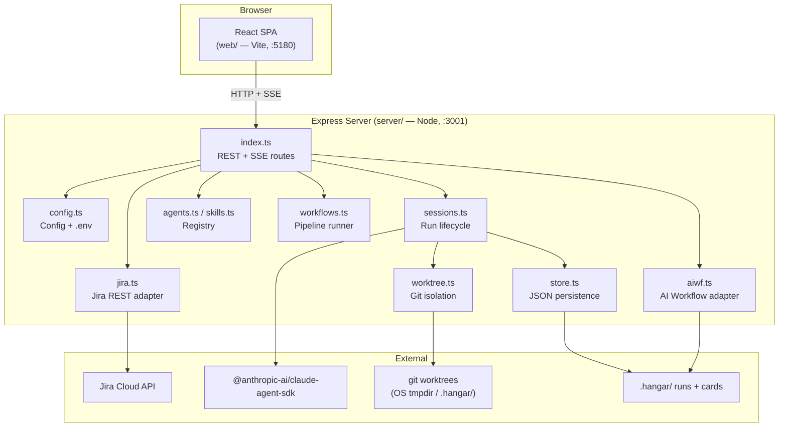
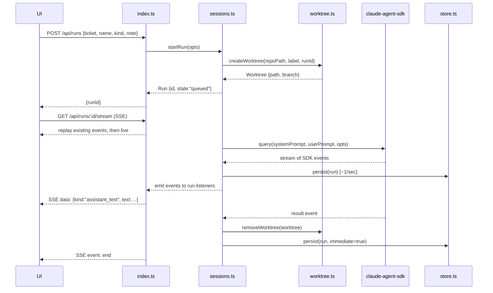

# Architecture

**Version:** 1.0
**Date:** June 2026

---

## System Overview

Hangar is a single-operator, localhost-only tool. A React web app presents Jira tickets and AI
Workflow project cards as a Kanban board; assigning an agent or skill to a card spawns a Claude
Code session via the Anthropic Agent SDK. The session runs in an isolated git worktree, streams
output back over SSE, and persists its transcript to disk.



---

## Components

### `index.ts` — Express API entry point

**Responsibility:** Middleware setup (CORS, rate limiting, body parsing), router mounts, and
`app.listen`. Routes are split into domain modules under `server/src/routes/`. Delegates all
business logic to the modules below.

**Technology:** Express 4 + `express-rate-limit`. TypeScript, `tsx watch` in dev.

**Route modules (`server/src/routes/`):**
- `config.ts` — `GET /api/health`, `GET|PUT /api/config`, `GET|PUT /api/settings/jira`
- `jira.ts` — `GET /api/tickets`, transitions, `GET /api/agents`, `GET /api/skills`, `/api/jira/*`
- `runs.ts` — full run lifecycle: `POST|GET /api/runs`, SSE stream, message, permissions, stop, delete, terminal, `GET /api/fs/exists`
- `workflows.ts` — `POST|GET|DELETE /api/workflows/runs*`
- `aiwf.ts` — all `/api/aiwf/*` routes: projects, cards, checkout, worktrees, docs, install/uninstall

**Key design decisions:**
- Routes split into 5 domain modules (~78-line `index.ts`). Each module owns its imports and can be tested in isolation.
- Rate limiting on session-spawn endpoints: 30 req/min per IP. Guards against runaway loops
  or misconfigured clients — not a security boundary.
- CORS is open (no origin restriction) — acceptable for a localhost-only tool.

---

### `sessions.ts` — Run Lifecycle

**Responsibility:** The core engine. Builds SDK options, dispatches `query()`, manages run
state, emits events, handles permissions, streaming input, PR detection, and phase tracking.
Also manages the exclusive-runtime queue for Docker/port-bound agents.

**Technology:** `@anthropic-ai/claude-agent-sdk` v0.3.177. Streaming-input mode (push-driven
async iterable). In-memory `Map<string, Run>`.

**Run state machine:**
```
queued → starting → running → awaiting_input ⇄ running → done
                                                         ↘ error
                                                         ↘ stopped
```

**Key behaviors:**
- **System prompt:** agent `.md` body; skill runs load `~/.claude` so the skill's slash command
  is available.
- **Working directory:** the board's first `repoPath` / the aiwf project's `repoPath`.
  Additional `repoPaths` become `additionalDirectories` in the SDK (cross-repo access).
- **Isolation:** `createWorktree()` → run executes in the worktree → `removeWorktree()` on
  completion. `skipWorktree: true` bypasses isolation for scaffold runs and task-scoped paths.
- **Permission model (`bypassPermissions` default `true`):** When gated, `AUTO_ALLOW_TOOLS`
  (reads + file edits) run automatically. Shell commands are classified by `isSafeBashCommand`
  in `safe-shell.ts`; unrecognized or risky commands (`$()`, backticks, `>` redirect) pause for
  Allow/Deny in the run panel.
- **Exclusive runtime:** `exclusiveAgents` config — agents that bind shared ports or start
  Docker run one at a time via a FIFO queue. Other agents run in parallel.
- **Phase tracking:** derived from `TodoWrite` calls; the active todo item is the current phase
  label, surfaced in the run panel and persisted.
- **PR detection:** regex scan of assistant text for `github.com/.*/pull/\d+`; detected URL is
  emitted as a `pr` event and saved on the run.
- **AskUserQuestion:** agent's tool call queues a pending promise; the operator's answer
  (from `/api/runs/:id/message`) resolves it and resumes the session.
- **Persistence cadence:** events coalesced to ~1 write/sec during streaming; terminal states
  (done/error/stopped) flush immediately.

---

### `worktree.ts` — Git Isolation

**Responsibility:** Create and remove git worktrees for isolated session execution. Also
exposes `pruneWorktrees` (startup cleanup), `currentBranch`, and `checkoutBranch`.

**Two worktree modes (simplification target):**

| Mode | When used | Location | Lifecycle |
|------|-----------|----------|-----------|
| **Ephemeral** | Agent runs + non-delivery skills | OS tmpdir (`/var/folders/…/hangar-worktrees/<runId>/`) | Created at run start; removed at run end |
| **Task-scoped** | Delivery skills (`/feature`, `/fix`, etc.) on aiwf cards or Jira tickets | `.hangar/worktrees/` (durable) | Persists across runs on the same card; removed on card checkout or explicit cleanup |

The dual-mode evolved organically and is now a simplification target. The intended future state
is a single cleanup model: a unified worktree registry that tracks all live worktrees and sweeps
orphans on startup and at run end.

**Cleanup today:**
- On run end: `removeWorktree()` called in `sessions.ts` final cleanup block.
- On startup: `pruneWorktrees()` called for each board's repo root in `index.ts` startup path
  (`git worktree prune` — removes entries whose paths no longer exist on disk).
- `SIGTERM` / `SIGINT`: `clearRuns("all")` stops active runs and their cleanup path runs.

**Known gap:** Runs that exit uncleanly (process kill between worktree create and the final
cleanup block) can leave both the filesystem path and the git entry registered. `git worktree
prune` handles the git-side orphan, but the filesystem directory may persist.

---

### `store.ts` — Persistence

**Responsibility:** Atomic JSON file writes for run records and workflow records. No database.

**Technology:** Node.js `fs`. Atomic via tmp-rename (`writeFileSync` + `renameSync`).

**Layout:**
```
.hangar/
  runs/<runId>.json          # serialized RunRecord (Run minus live handles)
  workflows/<workflowId>.json
  aiwf/<projectId>/board/    # aiwf card markdown files (managed by aiwf.ts)
```

`DATA_DIR` defaults to `<repo root>/.hangar/`, overridable via `HANGAR_DATA_DIR`.

**On startup:** `loadPersistedRuns()` restores all run records; any that were `running` or
`starting` are marked `stopped` with an explanatory event (their SDK process is gone).

---

### `config.ts` — Configuration

**Responsibility:** Load, validate, and save `hangar.config.json` (boards, agents dir, runtime
settings). Read and write `.env` (Jira credentials). Expose `PORT`. Hold config in memory and
hot-swap on `PUT /api/config` — no restart needed.

**Config file:** `hangar.config.json` (gitignored). Template: `hangar.config.example.json`.
**Credentials:** `.env` (gitignored). Template: `.env.example`.

The Jira API token is write-only: it's saved to `.env` but never returned to the browser.

---

### `jira.ts` — Jira Adapter

**Responsibility:** All Jira Cloud REST calls. Fetches tickets (JQL per board), tests
connection, lists projects and statuses for discovery, transitions issues, and resolves PR
URLs (dev-status API → remote links → comments, in order).

**Technology:** `fetch` with Basic auth (email + API token). No Jira SDK.

---

### `aiwf.ts` — AI Workflow Adapter

**Responsibility:** Everything touching the AI Workflow (aiwf) connection — card CRUD,
phase-lifecycle management, worktree state for task branches, install/uninstall of the toolkit,
doc listing (flat `listProjectDocs` for the docs modal; tree `listProjectDocTree` for the
sidebar), and doc content serving (`getProjectDocByPath` — path-validated, `docs/`-scoped).

**Card storage:** Markdown files in `.hangar/aiwf/<projectId>/board/`. Cards have YAML
frontmatter (`status`, `kind`, `prUrl`, `skill`, `history[]`, `archived`).

**Worktree state:** Tracked in `.hangar/aiwf/<projectId>/worktrees/<cardKey>.json`. Each entry
holds `worktreePath`, `taskBranch`, and `createdAt`. This registry is the source of truth for
which cards have live task branches.

**Spec cards:** Read from `<repoPath>/docs/specs/` — read-only, sourced from the repo, not the
data dir. A spec directory (multiple `.md` files inside) is presented as a single card with
`specChildren`.

---

### `agents.ts` / `skills.ts` — Registry

**Responsibility:** Parse agent `.md` files (from `agentsDir`, default `~/.claude/agents/`) and
skill directories (user `~/.claude/skills/` + per-repo `.claude/skills/`) into the fleet shown
in the assign menu.

**Agent frontmatter parsed:** `model`, `tools`, description (first non-heading paragraph).
**Skill frontmatter parsed:** `model`, description. Skills from repos are flagged with their
repo basename so the UI can distinguish `pp-debugger (eyeconic)` from `pp-debugger (user)`.

---

### `workflows.ts` — Pipeline Runner

**Responsibility:** Run a board's multi-step workflow config: executes each step in sequence,
passing the previous step's result as the next step's context (handoff). Each step is a
`startRun()` call; the workflow runner observes state changes via `run.onState`.

---

### `safe-shell.ts` — Shell Safety Classifier

**Responsibility:** Classify a Bash command as safe (auto-run) or risky (needs approval) when
the permission mode is gated. Risky patterns: command substitution (`$(…)`, backticks), output
redirection (`>`), unknown base commands.

---

### Web: `App.tsx` + `components/`

**Responsibility:** The full UI. Single-page app with two connection modes (Jira / AI Workflow)
and four overlays (board, settings, sessions, run panel).

**State:** React `useState` held in `App.tsx`. No external state manager. Polling (periodic
`GET /api/tickets`, `GET /api/runs`) for board and session list updates; SSE for live run output.

**Key components:**
- `Board` — Kanban columns + card drag-and-drop; assign menu; workflow trigger.
- `RunPanel` — SSE subscriber; renders assistant text (via `Markdown`), tool call events,
  phase badge, cost, PR link, permissions, and AskUserQuestion prompts.
- `SessionsView` — tabbed run list grouped by project.
- `AiWorkflow` — aiwf board (cards as columns), project switcher, install/uninstall flow,
  skills guide modal, worktree management, branch checkout.
- `DocTreeSidebar` — persistent left sidebar (220px) showing the project's AIWF doc tree
  (PRD, architecture, design, roadmap, specs). Collapsible; state persisted to `localStorage`.
- `DocPanel` — right-hand doc viewer (reuses RunPanel CSS shell); fetches and renders doc
  markdown by relative path; replaces RunPanel when a doc is open.
- `AiwfDocsModal` — multi-tab docs browser (📖 Docs & Specs); serves aiwf toolkit docs and
  per-project spec/doc files.
- `Settings` — Jira connection, boards config, permission toggle, terminal command.

**Theme:** CSS custom properties (`--bg`, `--fg`, `--accent`, …). `useTheme.ts` toggles
light/dark and persists to `localStorage`. No external CSS framework.

**Icons:** `lucide-react`. No other UI library.

---

## Data Flow

### Agent run (Jira ticket → SSE output)



### SSE reconnect (history replay)

On reconnect, `GET /api/runs/:id/stream` iterates `run.events` (the full in-memory history)
and writes each event before switching to live mode. This gives reconnecting clients a complete
replay without a separate log endpoint. There is no partial-replay mechanism — clients receive
the full event list from event 0 on every connect.

---

## Technology Stack

| Layer | Technology | Version | Rationale |
|-------|-----------|---------|-----------|
| Session runner | `@anthropic-ai/claude-agent-sdk` | 0.3.177 | Official SDK; abstracts auth, streaming, tool dispatch, and permission mode |
| Server runtime | Node.js + TypeScript | 18+ / 5.7 | Async-native; `tsx watch` gives hot-reload without a build step in dev |
| Server framework | Express 4 | 4.21 | Minimal; adequate for a single-operator local tool |
| Frontend framework | React 18 + Vite 6 | 18.3 / 6.0 | Standard; Vite's dev proxy keeps the server URL transparent |
| Frontend language | TypeScript | 5.7 | Type-safe API wrappers; `web/src/types.ts` mirrors server types |
| Icons | `lucide-react` | 1.18 | No other UI library; CSS custom properties for theming |
| Markdown rendering | `react-markdown` + `remark-gfm` | 10.1 / 4.0 | Agent output and card bodies |
| Persistence | JSON files on disk | — | No DB dependency; run records are bounded in size; single-process access |
| Git isolation | `git worktree` (stdlib) | — | OS-provided; no extra deps; per-run branch isolation |

---

## Deployment Model

Hangar is a **localhost development tool**, not a server application.

```
Machine (macOS / Linux)
├── Terminal A: npm run dev:server   → http://localhost:3001 (Express)
└── Terminal B: npm run dev:web      → http://localhost:5180 (Vite dev server)
                                         └── /api/* proxied to :3001
```

The web dev server's `vite.config.ts` proxy forwards all `/api` requests to the Express server,
so the browser only speaks to `:5180`.

**No CI/CD, no containers, no cloud.** The operator clones the repo, configures `.env` and
`hangar.config.json`, and runs `npm run dev`. Auth is the operator's existing Claude Code
login (`~/.claude`) or `ANTHROPIC_API_KEY` in the environment.

**Port configuration:**
- Server: `PORT` env var (default 3001).
- Web: `WEB_PORT` env var (default 5180); proxy target follows `PORT`.

**Security posture:** No auth layer. Do not expose port 3001 beyond `127.0.0.1`. Run
transcripts under `.hangar/` may contain file contents read by agent sessions — treat as sensitive.

---

## Key Architectural Decisions

| Decision | Choice | Alternatives considered | Rationale |
|----------|--------|------------------------|-----------|
| **Session runner** | `@anthropic-ai/claude-agent-sdk` | Raw Anthropic API + claude CLI subprocess | SDK handles auth, streaming, tool dispatch, and permission mode out of the box; subprocess approach lacks structured event stream |
| **Streaming to browser** | SSE with full history replay on reconnect | WebSocket; long-poll | SSE is fire-and-forget from the server (no bidirectional state); history replay avoids a separate log API |
| **Persistence** | JSON files per run | SQLite; PostgreSQL | No DB dependency; single-process; run records don't need relational queries; bounded size |
| **Git isolation** | `git worktree` | Docker volumes; no isolation | Isolation without containers; agent has full git history; each run gets its own branch naturally |
| **Config hot-reload** | In-memory swap on PUT `/api/config` | File watch (`chokidar`) | Simpler; the Settings UI is the only config writer; no race conditions |
| **Domain route modules** | 5 route files under `routes/` | Single `index.ts` (prior) | Navigable by domain; each module testable in isolation; `index.ts` reduced to ~78 lines |
| **No state manager** | React `useState` in `App.tsx` | Redux; Zustand | App state is simple enough; adding a manager would be premature |
| **No test suite (web)** | `npm run typecheck` as the gate | Jest + Testing Library | Deliberate trade-off: solo maintainer; typecheck catches structural errors; behavioral testing deferred |

---

## Constraints and Known Technical Debt

### Worktree lifecycle (priority)
The dual worktree mode (ephemeral OS tmpdir + task-scoped `.hangar/`) evolved organically and
should be unified. The target is a single worktree registry that:
- Tracks every live worktree by `runId` or `cardKey`.
- Removes them at run end (already done for ephemeral).
- Sweeps orphans on startup (already done for Jira boards; not comprehensive for aiwf paths).
- Exposes a management UI entry so the operator can force-remove any stale entry.

### SSE reconnect
History replay sends all events from seq 0 on every reconnect. For a 300-turn session, this
is thousands of events. A reconnect-with-cursor (`Last-Event-ID` header) would let clients
receive only missed events. Not implemented; acceptable for current session lengths.

### In-memory run state
`runs: Map<string, Run>` lives in the Node.js process. A process restart loses all in-flight
`listeners` sets and `pending` permission requests (the sessions themselves stop; their
transcripts are recovered from disk). Acceptable for a single-operator tool; would need
rethinking for any multi-process or cluster deployment.

### `web/src/types.ts` mirrors `server/src/types.ts`
Types are manually kept in sync (no code generation). A mismatch is a runtime bug that
typecheck won't catch. A shared `types/` package (or a code generation step from the server
types) would eliminate the drift risk; deferred as low-urgency given the solo-maintainer pace.

### No web tests
The web has no test suite. Correctness relies on TypeScript for structure and manual
verification for behavior. The `__tests__/` directory under `server/src/` has growing coverage
for the server side; web testing is future work.
