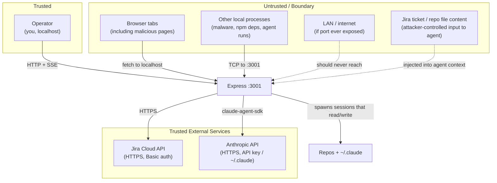

# Threat Model

**Version:** 1.0
**Date:** June 2026

---

## Trust Assumptions

Hangar is a **single-operator, localhost-only tool**. The Express server at `:3001` is intended
to be reachable only from the same machine. There is no authentication layer: any client that can
reach the port has full control over the server.

**What is trusted:** The operator (the person running `npm run dev`) and the host OS.  
**What is not trusted:** Any HTTP caller to `:3001` other than the operator's own browser tab on
`:5180`, the content of Jira tickets and repo files (which an attacker may control), and any
process spawned during an agent run (which inherits full OS permissions when unrestricted).

---

## Security Properties

Non-negotiable invariants that must always hold:

- The Jira API token must never be returned to the browser or appear in logs.
- The Anthropic API key / `~/.claude` session credentials must never be transmitted outside the
  host machine.
- The server must not be bound to `0.0.0.0` or exposed beyond `127.0.0.1`.
- Agent transcripts in `.hangar/` must never be committed to a git repository.

---

## Attack Surface

| Surface | Exposure | Controls today |
|---------|----------|----------------|
| `PUT /api/config` | Any client reaching :3001 | None (no auth, no schema validation) |
| `PUT /api/settings/jira` | Any client reaching :3001 | Token is write-only (never returned) |
| `POST /api/runs` | Any client reaching :3001 | Rate limit: 30 req/min |
| `GET /api/runs/:id/stream` (SSE) | Any client reaching :3001 | None |
| `POST /api/runs/:id/message` | Any client reaching :3001 | None |
| `POST /api/runs/:id/permissions/:requestId` | Any client reaching :3001 | None |
| `GET /api/check-path?path=` | Any client reaching :3001 | None (arbitrary path existence check) |
| `POST /api/aiwf/projects` | Any client reaching :3001 | repoPath existence check |
| `POST /api/aiwf/install` | Any client reaching :3001 | None |
| `POST /api/runs/:id/terminal` | Any client reaching :3001 | Session ID validation; dir shell-quoted |
| `GET /api/aiwf/projects/:id/docs/:slug` | Any client reaching :3001 | Slug: `/^[A-Za-z0-9_-]+$/` |
| Agent filesystem access | Full OS access when unrestricted | `bypassPermissions: false` (gated mode) |
| `.hangar/` transcript files | OS file system | `.gitignore`; OS user permissions |

---

## Threats

### 1. Unauthorized API Access

#### 1a. CSRF / Malicious Web Page

| # | Attack | Impact | Likelihood | Defense |
|---|--------|--------|------------|---------|
| 1 | A malicious page visited in the same browser calls `http://localhost:3001/api/runs` via `fetch`, spawning an agent session | Agent runs unrestricted on operator's machine; can read secrets, push code, execute commands | High (open CORS, no auth) | Rate limit; no other control |
| 2 | CSRF to `PUT /api/config` rewrites `repoPaths` to a sensitive directory | Next agent run executes in the wrong repo | Medium | Config schema partially validates structure |
| 3 | CSRF to `GET /api/runs` / `GET /api/runs/:id/stream` exfiltrates full transcript history | Leaks all file content the agent read during previous sessions | Medium | None |

**Root cause:** `app.use(cors())` sets no `origin` restriction. Standard CORS blocks credentials
by default, but `fetch("http://localhost:3001/api/...", { mode: "no-cors" })` still fires the
request — and state-changing endpoints (POST/PUT) don't require a response body for harm.

#### 1b. Malicious Local Process

| # | Attack | Impact | Likelihood | Defense |
|---|--------|--------|------------|---------|
| 4 | A compromised npm dependency or malware calls `:3001` directly | Same as CSRF — full API access | Low–Medium | Rate limit; bind to 127.0.0.1 |
| 5 | An agent session (spawned by a prompt-injection attack) calls back to `:3001` to approve its own pending permission | Bypasses the human-in-the-loop permission gate | Low | Agent runs in worktree, not the server process |

#### 1c. Accidental LAN / Cloud Exposure

| # | Attack | Impact | Likelihood | Defense |
|---|--------|--------|------------|---------|
| 6 | Server bound to `0.0.0.0` (VM, Docker, or accidental `HOST=0.0.0.0`) exposes the API remotely | Remote unauthenticated arbitrary code execution via agent spawn | Low, catastrophic | README warning; no code-level bind restriction |

---

### 2. Prompt Injection

| # | Attack | Impact | Likelihood | Defense |
|---|--------|--------|------------|---------|
| 7 | Crafted Jira ticket body contains `<instructions>` that override the agent's system prompt | Agent exfiltrates secrets, commits malicious code, or transitions unrelated tickets | Medium | No input sanitization; `bypassPermissions: false` (gated mode) limits blast radius |
| 8 | A file in the target repo contains injected instructions that the agent reads during a run | Same as above; harder to detect because the file is "trusted" content | Medium | Gated mode; git history provides audit trail |
| 9 | An injected agent instruction calls back to `:3001/api/runs/:id/permissions/:requestId` to self-approve a pending permission | Bypasses human-in-the-loop | Low | Requires knowing the requestId (currently a UUID) |

---

### 3. Shell Injection

| # | Attack | Impact | Likelihood | Defense |
|---|--------|--------|------------|---------|
| 10 | `aiwf.ts` builds shell strings: `` execSync(`"${aiwfBin}" version`) `` and `` execAsync(`"${aiwfBin}" uninstall-all`) `` — if `aiwfBin` (a filesystem path) contains shell metacharacters, it executes arbitrary code | Arbitrary shell execution under the server process | Very Low (requires crafted homedir path) | None — `aiwfBin` comes from `path.join(os.homedir(), ".local", "bin", "aiwf")`; unusual but not impossible |

---

### 4. Config / Path Injection

| # | Attack | Impact | Likelihood | Defense |
|---|--------|--------|------------|---------|
| 11 | `PUT /api/config` accepts `req.body as HangarConfig` with no schema validation beyond `validateConfig` in `config.ts` — a crafted payload could set `repoPaths` to sensitive dirs | Agent sessions execute in unintended directories, reading secrets | Low (requires API access first) | `validateConfig` enforces basic structure; no path allow-list |
| 12 | `GET /api/check-path?path=...` accepts any filesystem path and returns whether it exists | Host filesystem enumeration (e.g. `/etc/passwd`, `~/.ssh/id_rsa`) | Low (localhost only) | None |

---

### 5. Sensitive Data Disclosure

| # | Attack | Impact | Likelihood | Defense |
|---|--------|--------|------------|---------|
| 13 | Agent session (unrestricted) reads `~/.claude/` or env vars containing `ANTHROPIC_API_KEY` | Exfiltration of Claude authentication | Low (requires prompt injection) | `.gitignore` on `.hangar/`; gated mode limits reach |
| 14 | `.hangar/runs/*.json` transcripts are indexed by a local search tool, backup, or accidentally shared | Credentials, source code, and PII from Jira tickets exposed | Medium (backup tools, Spotlight, etc.) | `.gitignore`; no encryption |
| 15 | GDPR: Jira ticket content (customer names, support details) is sent to Anthropic's API as agent context and persists indefinitely in `.hangar/runs/` | GDPR retention obligation not met; no deletion mechanism for individual tickets | Medium | `DELETE /api/runs/:id` exists but no retention policy |

---

## Sensitive Data Inventory

| Data | Classification | At Rest | In Transit | Access Control |
|------|---------------|---------|------------|----------------|
| Jira API token | Secret | `.env` (plaintext) | HTTPS to Jira Cloud | OS file permissions |
| Anthropic API key / `~/.claude` auth | Secret | OS env + `~/.claude/` | HTTPS to Anthropic | OS file permissions |
| Agent transcripts | Confidential (may contain secrets + PII) | `.hangar/runs/*.json` (plaintext) | SSE on localhost (unencrypted) | OS file permissions; gitignored |
| Jira ticket content (titles, descriptions) | Confidential (may contain PII) | In-memory + transcripts | HTTPS Jira → server → browser | None beyond localhost |
| Repo source code + `.env` files in repos | Confidential | Disk (repos) | Unencrypted on localhost | OS file permissions; agent scope |
| Board config (`hangar.config.json`) | Internal | Disk (plaintext) | HTTP on localhost | Gitignored |

---

## Security Controls

### Implemented

- **Jira token write-only** — token saved to `.env` but the `GET /api/settings/jira` response returns only `hasToken: bool`, never the value.
- **`.gitignore` for secrets** — `.env`, `hangar.config.json`, and `.hangar/` are all gitignored.
- **Rate limiting** on session-spawn endpoints (30 req/min per IP via `express-rate-limit`).
- **`execFile` with array args** for all git worktree operations — no shell interpolation.
- **Slug allowlist** in doc/spec serving — `getProjectDoc` rejects anything outside `/^[A-Za-z0-9_-]+$/`.
- **Shell-quoted `dir`** in terminal command template; session ID validated against UUID-ish charset before interpolation.
- **Demo mode isolation** — `HANGAR_DEMO=1` never spawns real processes, reads real config, or writes real state.
- **`bypassPermissions: false` (gated mode)** — available in Settings; holds mutating/unknown shell commands for Allow/Deny approval. Not the default.

### Required (not yet implemented)

Priority order:

1. **[HIGH] Restrict CORS origin** — replace `app.use(cors())` with `cors({ origin: ["http://localhost:5180", `http://127.0.0.1:${WEB_PORT}`] })`. Prevents CSRF attacks from malicious web pages (Threat 1–3).

2. **[HIGH] Bind server to `127.0.0.1`** — pass `{ host: "127.0.0.1" }` to `app.listen()`. Prevents accidental LAN/cloud exposure (Threat 6). Currently relies on documentation alone.

3. **[HIGH] Replace shell-string exec in `aiwf.ts`** — change `execSync(`"${aiwfBin}" version`)` and `execAsync(`"${aiwfBin}" uninstall-all`)` to `execFileSync(aiwfBin, ["version"])` / `execFile(aiwfBin, ["uninstall-all"])`. Eliminates the shell injection surface (Threat 10).

4. **[MEDIUM] Config schema validation** — add a Zod (or equivalent) schema to `validateConfig` that rejects unexpected fields and validates path shapes before `saveConfig`. Reduces config injection risk (Threat 11).

5. **[MEDIUM] Restrict `/api/check-path`** — validate that `req.query.path` resolves under one of the configured `repoPaths` before returning existence status. Stops filesystem enumeration (Threat 12).

6. **[MEDIUM] Default `bypassPermissions: false`** — change the default in `HangarConfig` and `hangar.config.example.json` to `false`. Add a prominent UI warning when unrestricted mode is enabled. Reduces blast radius for all agent-scope threats (Threats 7, 8, 13).

7. **[LOW] GDPR run retention policy** — document the data retention stance. Implement a configurable `runRetentionDays` setting that auto-deletes runs older than N days. Surface a "Delete transcript" button in the Sessions view that calls the existing `DELETE /api/runs/:id`. (Threat 15)

8. **[LOW] Restrict `.hangar/` file permissions** — set directory mode to `0700` on creation in `store.ts` so backup tools and other users on shared machines can't read transcripts. (Threat 14)

---

## Compliance Requirements

### GDPR

**Scope:** Hangar sends Jira ticket content (titles, descriptions, comments) to Anthropic's API
as agent context. This content may include customer names, email addresses, or other personal
data from your Jira instance. Agent transcripts persist this data indefinitely in `.hangar/runs/`.

**Current status:**

| Requirement | Status |
|-------------|--------|
| Data minimization | Not addressed — full ticket body is sent to Anthropic |
| Retention limits | Not implemented — transcripts persist until manually deleted |
| Right to erasure | Partial — `DELETE /api/runs/:id` exists but is manual and undiscoverable |
| Data processor agreement | Anthropic's DPA covers API usage; operator is responsible for ensuring coverage |
| Cross-border transfer | Anthropic API processes data outside the EU by default |

**Recommended actions:**
- Add a `runRetentionDays` config option (see control #7 above).
- Document in the README that Jira ticket content is sent to Anthropic's API so operators can make an informed choice.
- Consider a `sanitizeTicketBody` option that strips the ticket description before it becomes part of the agent prompt, relying only on the title + ticket key.
