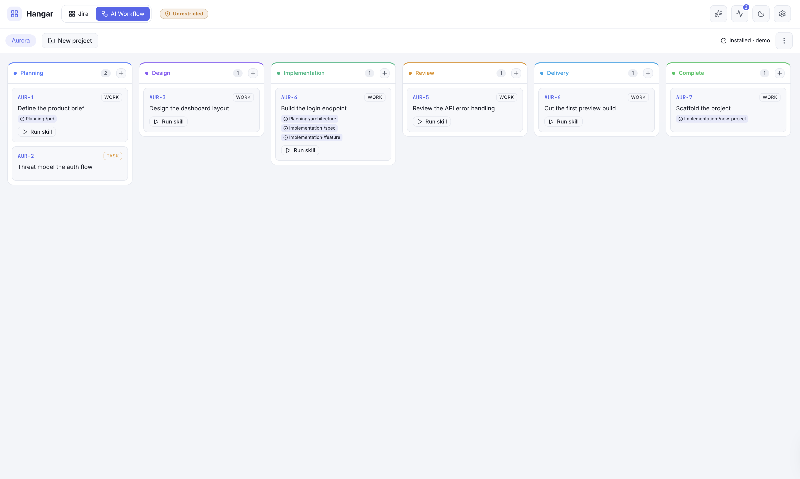
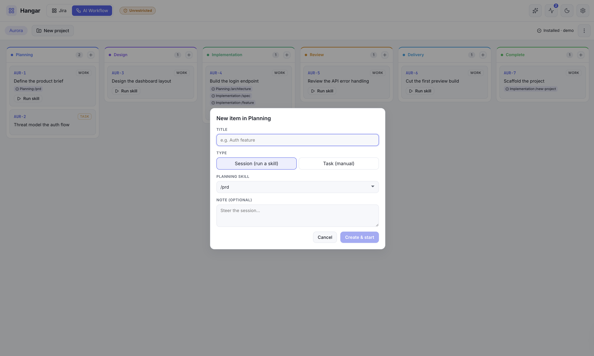

# AI Workflow connection

Hangar has two **connections** (work sources), selected from the topbar switcher:

- **Jira** — the default: project boards + filters, backed by the Jira REST API.
- **AI Workflow** — a **self-hosted** source for projects that use
  [ai-workflow](https://github.com/0xrafasec/ai-workflow) (aiwf, by
  [0xrafasec](https://github.com/0xrafasec)) instead of a tracker.

Each connection renders its own sub-menu row beneath the switcher and shares the board surface and
the live run panel. **All AI Workflow runs are executed by Claude** (Hangar's existing
`@anthropic-ai/claude-agent-sdk` engine) — the connection is a methodology + a board, not a different
model. A project that happens to be Gemini-based (`GEMINI.md`) just becomes context Claude reads.



> Keep this doc in sync with the feature — see the rule in `CLAUDE.md`.

## What aiwf is

ai-workflow is a Claude-native, spec-driven-development toolkit installed globally into `~/.claude/`
(`skills/`, `agents/`, `commands/`, `CLAUDE.md`, `settings.json`) plus an `aiwf` launcher in
`~/.local/bin/`. Because Hangar already reads `~/.claude/skills` (`server/src/skills.ts`), **once aiwf
is installed its skills appear in Hangar automatically** — no extra wiring.

The skills, by lifecycle phase (this mapping is `SKILL_GROUPS` in `server/src/aiwf.ts`):

| Phase            | Skills                                                       |
| ---------------- | ------------------------------------------------------------ |
| Planning         | `prd`, `architecture`, `tdd`, `security`, `adr`, `rfc`, `roadmap`, `issues` |
| Design           | `design`, `verify-design`                                    |
| Implementation   | `spec`, `feature`, `fix`, `autopilot`, `factory`, `new-project` |
| Review           | `review`, `sec-review`                                       |
| Delivery         | `commit`, `pr`                                               |

## Install / detect / uninstall

The AI Workflow sub-bar shows install state and an options menu:

- **Detect** — `GET /api/aiwf/status` reports `installed` based on the `~/.local/bin/aiwf` launcher
  and/or the core aiwf skills present in `~/.claude/skills`.
- **Install** — a one-click button (with a confirm) runs the aiwf bootstrap
  (`curl -fsSL …/bootstrap.sh | bash`) via `POST /api/aiwf/install`. Hangar only mutates `~/.claude`
  on your click.
- **Options menu (⋯)** — open the repo, open the author, **Reinstall**, and **Uninstall**.
  Uninstall (`POST /api/aiwf/uninstall`) runs `aiwf uninstall-all` — it removes the **toolkit only**;
  your projects and their board cards are never touched.

## Projects

An AI Workflow **project** is a registered local repo. Create one from the sub-bar ("＋ New project"):

- **New** — scaffolds the repo by running the `new-project` skill in place, then registers it.
- **Adopt** — registers an existing repo as-is.

Each project chip has an **Edit** (pencil) button that opens a modal to change the project's display
name and **location** (`repoPath`) in place — useful when the repo moves on disk or was registered
with the wrong path. The project keeps its id, and since the board lives in Hangar's data dir keyed
by that id, the cards carry over unchanged — re-pointing the location just runs future work against
the new path.

Projects are stored in `hangar.config.json` under `aiWorkflow.projects` (see
[Configuration](#configuration)). Cards are **runtime board state** — their `status:` and history
are rewritten on every move and run — so they live in **Hangar's own data dir** at
`<HANGAR_DATA_DIR>/aiwf/<projectId>/board/*.md` (gitignored, like `.hangar/`), **not** in the
project repo, which stays pristine. A task's durable description/acceptance criteria belong in a
tracked `docs/specs/NNN_*.md` (via the `spec` skill); the lasting record lives in `docs/` + the PR.
Point dev and stable Hangar instances at one `HANGAR_DATA_DIR` to share a project's board.

## The phase board

The board **columns are the aiwf lifecycle phases** plus a terminal **Complete** column
(`DEFAULT_COLUMNS`, configurable per project):

```
Planning → Design → Implementation → Review → Delivery → Complete
```

A **card is a work thread** that flows through the phases:

- **Create** — each phase column has a **＋** to add a **Session** (pick one of that phase's skills,
  with an optional note → creates the card and starts the run) or a **Task** (a manual card, no skill).
- **Move** — dragging a card into another phase column **pops up that phase's skill picker** to start a
  session there (or "Just move, no session"). Dropping into **Complete** just marks it done — no popup.
- **History** — every finished session is appended to the card's history, tagged with the phase it ran
  in. The card shows a compact `phase·/skill ✓` trail; the repo also accumulates the skill's own
  artifacts (`docs/ARCHITECTURE.md`, specs, etc.). Board + repo together are the project history.

Per-phase skills come from `COLUMN_SKILLS` (derived from `SKILL_GROUPS`; the `Complete` column has
none). The `roadmap` skill is additionally instructed to **seed the board** — it writes one card per
roadmap task into the project's board dir (Hangar passes it the absolute data-dir path).



### Execution model

AI Workflow sessions run **in place** in the project repo (`skipWorktree`), not in an isolated Hangar
worktree, because aiwf manages its own git (it has `/commit` and `/pr`) and its planning/doc skills
must write into the real repo. Each run is a normal `kind: "skill"` session streamed into the run
panel; on success its result is logged to the card via `appendCardHistory`.

### Card file format

`<HANGAR_DATA_DIR>/aiwf/<projectId>/board/<KEY>.md` — flat YAML frontmatter + markdown body + an
embedded history block:

```markdown
---
key: DC-1
title: Implement the login endpoint
status: Implementation
kind: thread
skill: feature
pr: https://github.com/me/app/pull/3
---

Acceptance criteria / context — fed into the agent prompt.

<!--HANGAR_HISTORY
[{ "phase": "Planning", "skill": "architecture", "at": 1718000000000, "runId": "…", "summary": "…" }]
HANGAR_HISTORY-->
```

`status` is the card's current phase column; `kind` is `thread` (runs skills) or `task` (manual). A
card maps onto Hangar's `Ticket` shape (`summary`=title, `boardKey`=project id, `source: "aiwf"`,
`description`=body) so runs / the run panel work unchanged.

## Configuration

In `hangar.config.json` (template: `hangar.config.example.json`):

```json
{
  "aiWorkflow": {
    "projects": [
      {
        "id": "example-project",
        "name": "Dynamic Core",
        "repoPath": "~/dev/dynamiccore",
        "columns": ["Planning", "Design", "Implementation", "Review", "Delivery", "Complete"],
        "createdAt": 0
      }
    ]
  }
}
```

`columns` is optional (defaults to the phases + Complete). The list is validated and persisted by
`validateConfig` / `saveConfig` in `server/src/config.ts`.

## API

All under `/api/aiwf/*` (defined in `server/src/index.ts`):

| Method + path                                        | Purpose                                              |
| ---------------------------------------------------- | ---------------------------------------------------- |
| `GET /api/aiwf/status`                               | install state + column/skill presets + repo/author  |
| `POST /api/aiwf/install`                             | run the aiwf bootstrap installer                     |
| `POST /api/aiwf/uninstall`                           | run `aiwf uninstall-all` (toolkit only)              |
| `GET /api/aiwf/projects`                             | list registered projects                            |
| `POST /api/aiwf/projects`                            | register `{ name, repoPath, mode: "new"\|"adopt" }`  |
| `PATCH /api/aiwf/projects/:id`                       | change a project's `{ name?, repoPath? }` (location) |
| `DELETE /api/aiwf/projects/:id`                      | unregister a project (repo files untouched)          |
| `GET /api/aiwf/projects/:id/cards`                   | list the project's cards                             |
| `POST /api/aiwf/projects/:id/cards`                  | create a card `{ title, status?, kind?, skill? }`    |
| `POST /api/aiwf/projects/:id/cards/:key/transition`  | move a card `{ status }`                             |
| `POST /api/aiwf/projects/:id/cards/:key/run`         | run a skill on a card `{ skill, note? }`             |

## Where it lives

**Server**

- `server/src/aiwf.ts` — phase/skill presets, install detect/bootstrap/uninstall, the markdown card
  store (`listCards`/`createCard`/`transitionCard`/`getCard`) and `appendCardHistory`.
- `server/src/index.ts` — the `/api/aiwf/*` routes.
- `server/src/sessions.ts` — tags aiwf card runs (`aiwfProjectId`/`aiwfPhase`) and logs results to the
  card on completion.
- `server/src/config.ts` — `aiWorkflow.projects` validation + persistence (`getAiwfProjects` /
  `saveAiwfProjects`).
- `server/src/types.ts` — `AiwfProject`, `AiwfHistoryEntry`, and the aiwf fields on `Ticket`.

**Web**

- `web/src/components/AiWorkflow.tsx` — `AiWorkflowBar` (sub-menu: project picker, install, options
  menu) and `AiWorkflowView` (the phase board, card create/move modals, the move-to-run skill picker).
- `web/src/App.tsx` — the connection switcher + sub-menu wiring (connection / overlay model).
- `web/src/api.ts`, `web/src/types.ts` — typed wrappers + mirrored types.

**Tests:** `server/src/__tests__/aiwf.test.ts` (card store + history + detect/install/uninstall) and
`server/src/__tests__/index.aiwf.test.ts` (the routes).

## Not in scope

- A non-Claude executor (Gemini, etc.) — aiwf is Claude-native and Hangar's engine is Claude.
- Cursor / Codex install targets (Claude only).
- Parsing aiwf's roadmap/spec doc formats — the board is seeded by instructing the `roadmap` run to
  emit cards in our schema, not by reverse-engineering aiwf's files.
